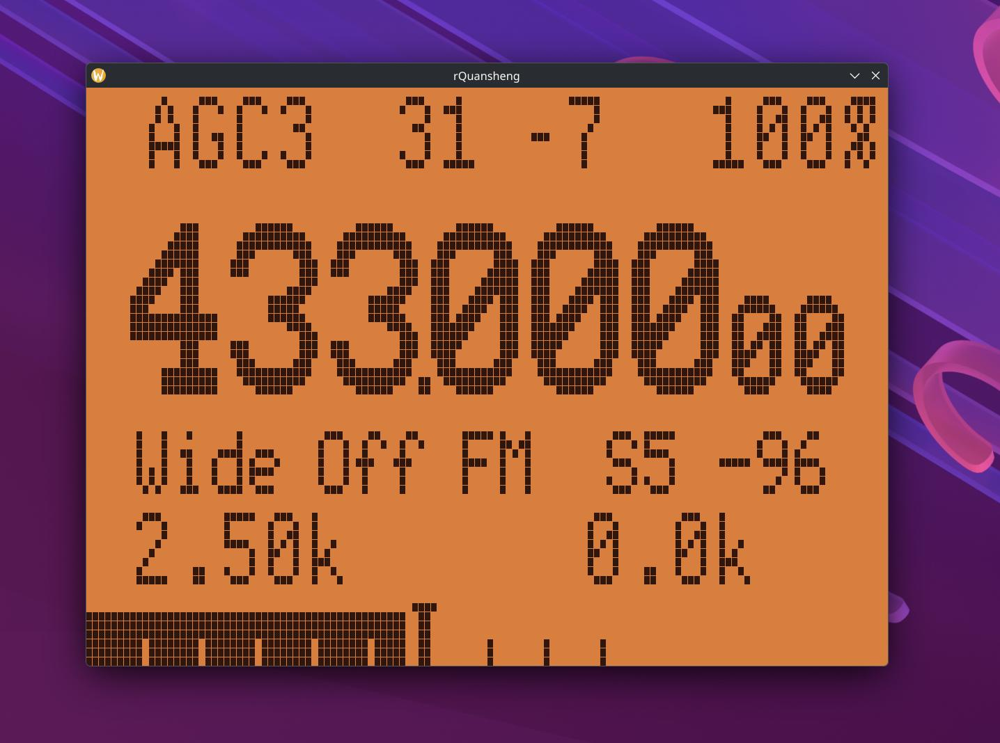
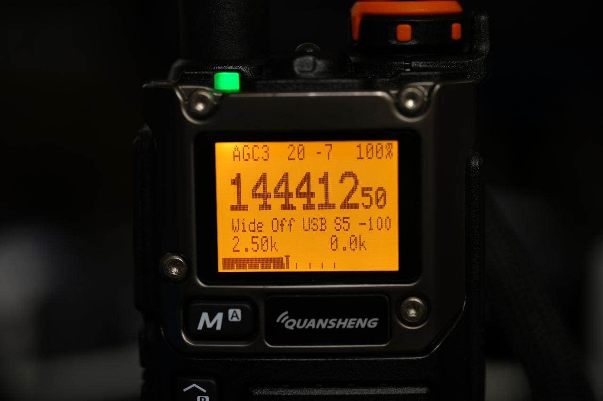
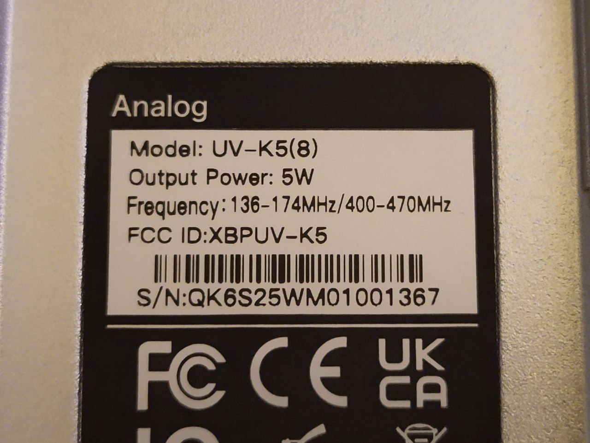

# rQuansheng

This is an highly experimental from-scratch reimplementation for a firmware for the Quansheng UV-K5 (v1) radio, made in Rust

This is not a black box reimplementation, some low-level parts are rewritten from C, some are inspired then refactored, some are original.

All the UI code is original.

# Flashing the firmware

1. `cd` to `cross/rquansheng`
1. put the radio in DFU (PTT + turn on)
1. run the command `cargo run --release`

A k5prog binary is vendored, from this fork: https://github.com/nica-f/k5prog

# PC Software

rQuansheng can run on a normal PC, controlling the radio chip on a physical device through the serial cable

1. flash the rQuansheng firmware
1. CTRL+C at the flasher logcat
1. go to the `host_sw` directory
1. run `RUST_LOG=INFO cargo run --release --bin emulator -- --serial /dev/ttyUSB0`

# Roadmap

## Basics
- [x] run a binary
- [x] pac driver
- [x] run RTIC
- [x] hal drivers
- [x] adc / battery level
- [x] bk4819 bitbang driver
- [x] bk4819 hal and library
- [x] bk1080 driver
- [x] keyboard driver and events
- [x] display driver
- [x] eeprom driver 

## High level
- [x] fm radio rx
- [x] fm radio tx
- [x] serial protocol for remote control
- [ ] defmt logs wrapped by the serial protocol
- [x] UI for transceiver state
- [ ] UI for menu
- [ ] UI for wfm rx (bk1080)
- [ ] eeprom settings save
- [x] support high / medium / low power tx (from eeprom calib. tables)
- [x] support 10 squelch levels (from eeprom calib. tables)
- [ ] support for CTCSS / DCS etc etc
- [x] support AM / SSB / raw etc reception
- [x] AM fix (not tested)

## In the far future, probably never
- [ ] spectrum analysis
- [ ] scanning
- [ ] ARDF

# Hardware support

This is developed and works for devices with this label

